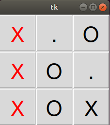
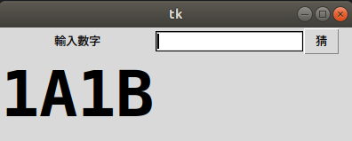
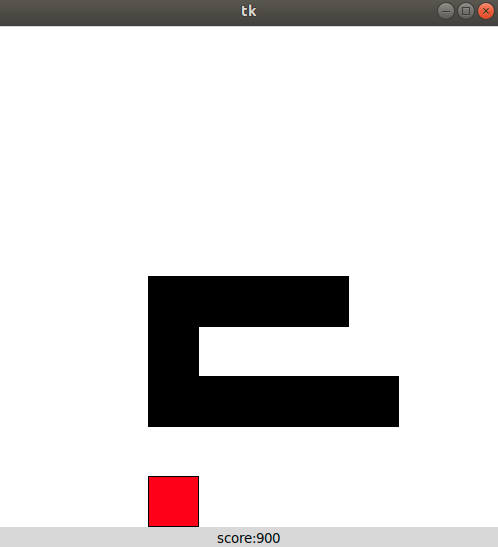
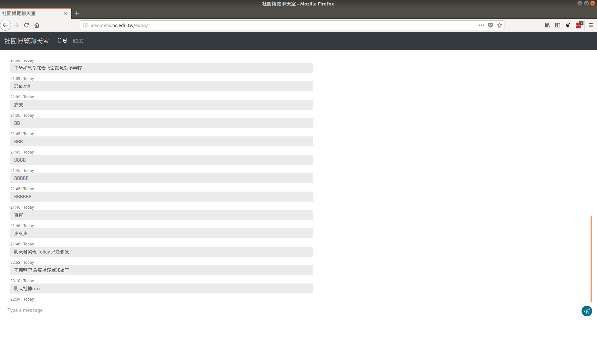

title: 107學年上學期 資研社
output: index.html

--
<br>
# ICED 實中資研社

--
<br>
# 競賽組
## 教學 蘇柏瑄

--
<br>
# 打競賽

-- 
<br>
# ~~打東東~~

--
<br>

# 學演算法

--
<br>

# 範例

--
### 題目


# A有 $x

--
### 題目

# 給了朋友B $y

--
### 題目

# 剩下?

--
### 演算法設計
# 如果 x >= y

--
### 演算法設計

# Ans: x - y

--
### 演算法設計

# 不然<br>Ans: 不足

--
### 寫程式

<style>
pre {
    font-size: 27px;
    padding-left: 20%;
}
</style>
<br>

```cpp
int A, B, x, y;
cin >> A >> B >> x >> y;

if(x >= y){
    cout << x-y << endl; 
}else{
    puts("Not Enough.QAQ");
}
```

--
<br>

# 評測

--

### Case 1

# 家翔有$10<br>給柏瑄$5

--

### Case 1

# 回答: 剩$5

--


### Case 1

# 正確～

--

### Case 2

# 小臺有$1000萬<br>給小薩$2500萬

--

### Case 2

# 回答: 不足QAQ

--


### Case 2

# 正確～

--

### Case 3

# 你有$200<br>給小華$50

--

### Case 3

# 回答: $150

---

### Case 3

# 真的嗎?

--


### Case 3

# 錯誤!!

--

### Case 3

# Ans: 還是$200

--

### Case 3

# 小華不是你朋友

--

### Case 3

# 醒醒吧<br>你根本沒朋友!

--
<br>

# 練習

--
<br>

# 比賽

--
<br>

# 出國 拿錢

--

# 學演算法<br>程式基本工<br>比賽 挑戰

--
<br>
# 應用組
## 教學 劉承亞
--
<br>
# 去年的作品

--

## 圈圈叉叉


<div align="center">
  
</div>

--

## 1A2B


<div align="center">
  
</div>


--

## 貪食蛇


<div align="center">
  
</div>
--

<br>
# 今年目標

--

## 即時聊天室系統


<div align="center">
  
</div>
--
<br>
# Demo

--
<br>
### 將學到的技能
- python
- socketIO
- HTTP 基礎
- html
- javascript
- css
- SQL
- 伺服器管理
- 技術文件閱讀

--
<br>
# 我都不會… (?)

--
<br>
# 關於面試
--
<div align="center">
  
--

# 學妹~~弟~~加資研~

<!--
> BB要教一下這怎麼用嗎
> > 不要 [name=bb]
> > > 傲教ORZ [name=TMD]
> > > 
> 要介紹怎麼選擇這兩個組別嗎？還是進社團在說 [name=TMD]
> > 我覺得不用 反正有講兩個組在做什麼 所以重點是他們自己想去哪邊到是說要講面試的方式 (?) 除非假設不會滿社 [name=bb]
> > 對!!!開個表單（？） [name=TMD]
> >
> 想新梗!!! [name=TMD]
> > QAQ [name=bb]
> > 可以喇APCS
> > 等等我發現去年就有講APCS <(_ _)>
-->
